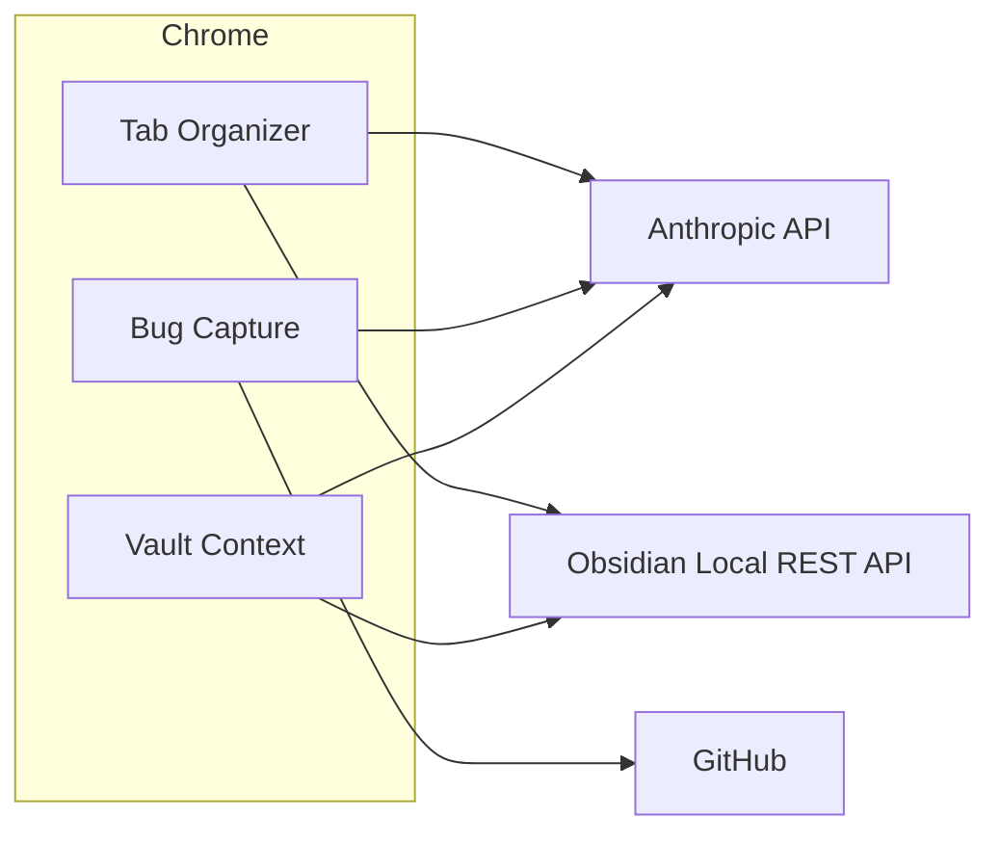

# Claude browser extensions

Chrome extensions that use Claude (and optionally Obsidian) to file bugs, group tabs, and clip pages into a vault. Each folder is a self-contained extension with its own build.

| Extension | What it does |
|-----------|--------------|
| [tab-organizer](tab-organizer/) | Groups tabs by topic with Claude, cleans up stale/duplicate tabs, saves keepers and a daily browsing digest to Obsidian |
| [bug-capture](bug-capture/) | Files a bug in one of your deployed apps as a GitHub issue: screenshot, console/network log, Claude-written repro steps, project board fields |
| [vault-context](vault-context/) | Badge showing which Obsidian notes relate to the current page; clip selections, tables and links into a note |



## Loading an extension

```bash
cd <extension>
npm ci
npm run build
```

Chrome → `chrome://extensions` → Developer mode → **Load unpacked** → select the extension's `extension/` folder.

## Config files

Settings (including API keys) live in Chrome storage. To copy them between machines, or to load a prepared mapping:

1. Copy `config.example.json` from the extension folder.
2. Fill in keys and your own host → repo / vault settings. Do **not** commit the filled file (`*.config.json` and `*.local.json` are gitignored).
3. Open the extension's Settings page → **Import…** and pick the JSON.

**Export** on the same page downloads the current settings as `<extension>.config.json`. Treat that file like a password.

The `extension` field in the JSON must match the extension (`bug-capture`, `tab-organizer`, or `vault-context`). Unknown keys are ignored.

Obsidian-backed extensions index the folders you list in Settings (default is [PARA](https://fortelabs.com/blog/para/): `00-Inbox`, `10-Areas`, `20-Projects`, `30-Resources`). The first folder is the inbox for new notes and digests.

## Privacy and the Chrome Web Store

- [Privacy policy](PRIVACY.md) — what stays on device vs what is sent to Anthropic, GitHub, or local Obsidian
- [Chrome Web Store checklist](docs/chrome-web-store.md) if you publish a listing later

## Development

```bash
node --test shared/*.test.js
npm run build --prefix bug-capture
npm run build --prefix tab-organizer
npm run build --prefix vault-context
```

CI runs the tests and all three builds on every push.

## License

[MIT](LICENSE)
